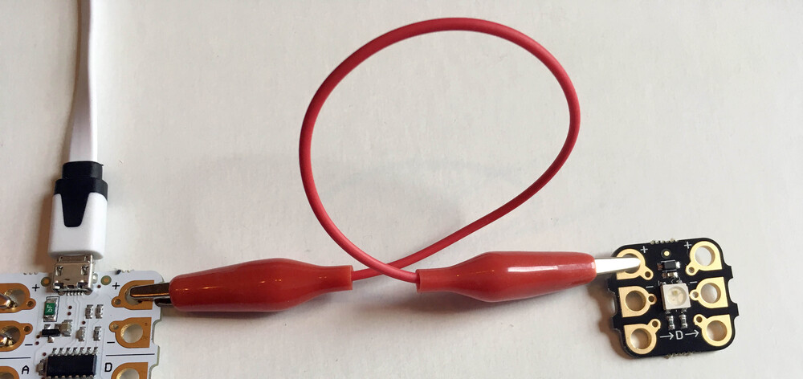
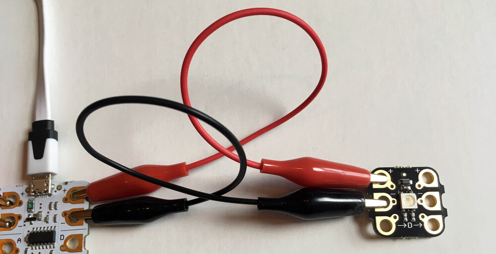
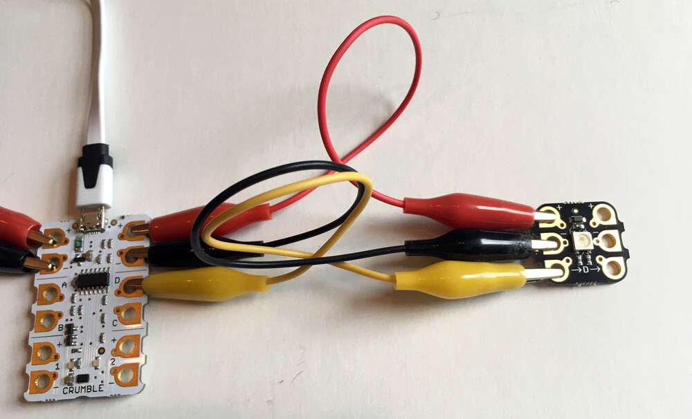

Use a crocodile clip to connect from the positive output (+) on the right side of the Crumble to the positive input (+) on the left side of the Sparkle.

--- /task ---

Now let's do the same for the negative connection.

--- task ---

Use another crocodile clip to connect from the negative output (-) on the right side of the Crumble to the negative input (-) on the left side of the Sparkle.

--- /task ---

And finally, we make the signal connection which must always be to the 'D' terminal on the Crumble. Sparkles will not work if connected to any other terminal.

The positive and negative cables supply power to the Sparkle but it is this signal connections that will tell the Sparkle what colour it should be.

--- task ---

Use a third crocodile clip to connect from the 'D' terminal on the right side of the Crumble to the ->D-> input on the left side of the Sparkle.

--- /task ---

Your Crumble Sparkle is now connected and ready to be coded.